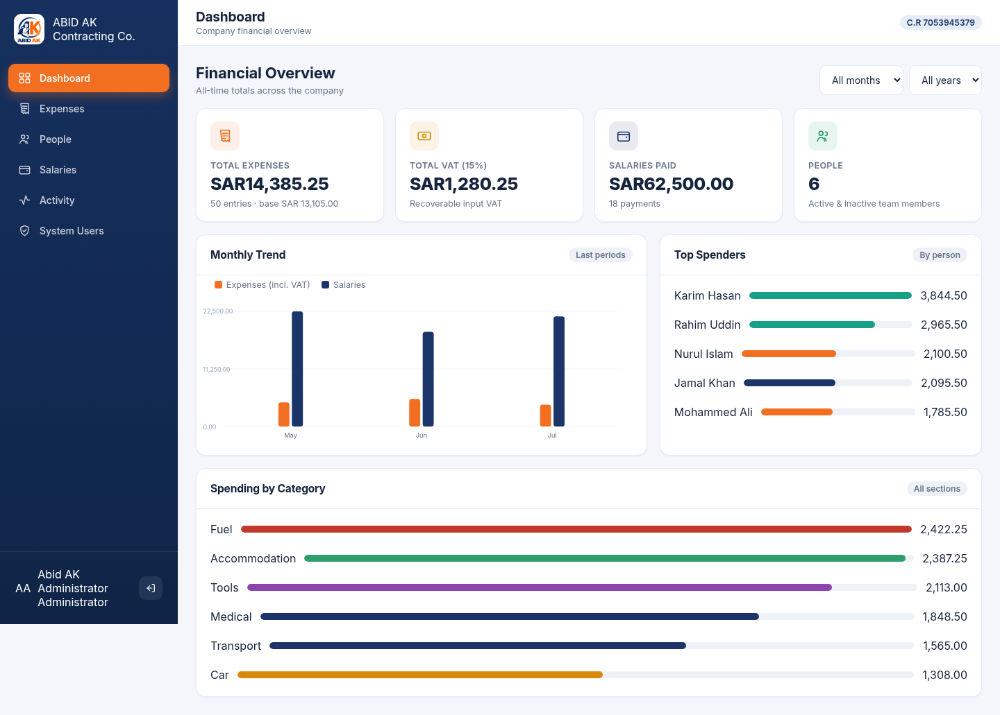

# ABID AK Contracting — Expense Management System

A complete expense, VAT and payroll management portal for **ABID AK Contracting Company**
(Al-Jubail, Kingdom of Saudi Arabia · C.R 7053945379).

Track team spending by person and by section, apply Saudi 15% VAT per entry, record monthly
salaries against passport numbers, scan barcodes from the camera, and keep a full audit trail —
all behind a branded login.



---

## ✨ Features

| Area | Highlights |
|------|-----------|
| **Landing / Login** | Branded split-screen using the company logo, Arabic name, CEO details, contact info and WhatsApp QR code. JWT username/password auth. |
| **Dashboard** | Live totals (expenses, VAT, salaries, people), monthly trend chart, top spenders, spending by category. Month/year filters. |
| **Expenses** | Add/edit/delete with **VAT 15% toggle** (live preview), date, reason, and **camera barcode/QR scanning**. Three views: *All Entries*, *By Person*, *By Section* — each with base / VAT / grand totals. |
| **People** | Full CRUD. Roles are pre-loaded from the company manpower list (78 roles across 12 departments). Passport & phone per person. |
| **Salaries** | Record monthly salary per employee **against a passport number**, with role captured at payment time. Filter by person / month / year. |
| **Activity Log** | Every create / update / delete / login recorded with user, entity and timestamp. |
| **System Users** | Admin-only management of who can access the portal. |
| **Everywhere** | Server-side pagination, toasts, modals, responsive layout, month/year filtering. |

## 🧱 Tech Stack

- **Frontend** — Next.js 15 (App Router, TypeScript), hand-crafted design system, native `BarcodeDetector` for scanning.
- **Backend** — FastAPI + SQLAlchemy 2.0, JWT auth (python-jose), bcrypt (passlib).
- **Database** — PostgreSQL on **Supabase** (via the connection pooler).
- **Deployment** — Docker + Docker Compose + Nginx, one-command `deploy.sh`, Let's Encrypt HTTPS.

## 📁 Project Structure

```
ABID_AK/
├── backend/                 # FastAPI service
│   ├── app/
│   │   ├── models/          # SQLAlchemy models (user, person, expense, salary, activity, role)
│   │   ├── schemas/         # Pydantic schemas
│   │   ├── routers/         # auth, persons, expenses, salaries, activity, dashboard, users, roles
│   │   ├── config.py database.py security.py deps.py seed.py main.py
│   ├── requirements.txt  Dockerfile  .env.example
├── frontend/                # Next.js app
│   ├── app/                 # landing (login) + (app) authenticated route group
│   ├── components/          # Modal, Toast, Charts, forms, BarcodeScanner, …
│   ├── lib/                 # api client, auth context, types, formatters, brand constants
│   ├── public/brand/        # logo.png (bg removed), qr.png (from the business card)
│   └── Dockerfile
├── deploy/                  # nginx.conf, nginx.ssl.conf
├── docker-compose.yml
├── deploy.sh                # build / up / ssl / logs helper
└── README.md
```

## 🚀 Quick Start (local, without Docker)

**1. Backend**
```bash
cd backend
python3 -m venv .venv && source .venv/bin/activate
pip install -r requirements.txt
cp .env.example .env          # fill in Supabase credentials
uvicorn app.main:app --reload # → http://localhost:8000  (docs at /docs)
```
On first run the API creates all tables, seeds the 78 job roles and a bootstrap admin
(`admin` / `abidak2024`).

**2. Frontend**
```bash
cd frontend
npm install
cp .env.example .env.local     # NEXT_PUBLIC_API_URL=http://localhost:8000
npm run dev                    # → http://localhost:3000
```

Sign in with **admin / abidak2024** and change the password from *System Users*.

## 🐳 Deploy to a VPS (samimreza.me)

Prerequisites: Docker + Docker Compose on the server, and DNS `A` record for
`samimreza.me` (and `www`) pointing to the VPS.

```bash
git clone <your-repo> abidak && cd abidak

# 1. configure secrets
cp backend/.env.example backend/.env      # add Supabase credentials + a strong SECRET_KEY
cp .env.example .env                       # set DOMAIN / PUBLIC_URL / CERTBOT_EMAIL

# 2. build & launch (nginx + frontend + backend)
./deploy.sh up                             # app live on http://samimreza.me

# 3. enable HTTPS (Let's Encrypt)
./deploy.sh ssl                            # app live on https://samimreza.me
```

Other commands: `./deploy.sh logs`, `./deploy.sh restart`, `./deploy.sh renew`, `./deploy.sh down`.

Nginx serves the frontend and proxies `/api`, `/health` and `/docs` to the backend, so the
whole app runs on a single origin (no CORS headaches in production).

## 🔐 Configuration

**backend/.env**

| Var | Purpose |
|-----|---------|
| `SECRET_KEY` | JWT signing key — **set a long random value in production**. |
| `ADMIN_USERNAME` / `ADMIN_PASSWORD` | Bootstrap admin, created only if no users exist. |
| `VAT_RATE` | Default `0.15` (Saudi standard rate). |
| `CORS_ORIGINS` | Comma-separated allowed origins (dev only; production is same-origin). |
| `SUPABASE_PROJECT_REF` / `SUPABASE_DB_PASSWORD` / `SUPABASE_POOLER_HOST` / `SUPABASE_POOLER_PORT` | Supabase Postgres pooler connection. A full `DATABASE_URL` overrides these. |

**.env (root)** — `PUBLIC_URL`, `DOMAIN`, `CERTBOT_EMAIL` used by Docker Compose / deploy.sh.

## 📊 Data Model

- **Person** — name, role, department, passport, phone, active.
- **Expense** — person, category (section), reason, barcode, amount, `vat_applied`, `vat_amount`, `total`, date (month/year indexed).
- **Salary** — person, role, **passport_number**, amount, pay date (month/year), note.
- **Activity** — user, action, entity, description, timestamp.
- **Role** — 78 seeded roles across Technicians, Civil, Rigging, Structural, Piping, Scaffolding, Welding, Painting, E&I, Safety, Equipment Operators and Management.

## 📷 Barcode Scanning

Uses the browser-native **BarcodeDetector API** (Chrome/Edge/Android) with an automatic manual-entry
fallback. Scanning requires HTTPS (or `localhost`) for camera access — enabled automatically by `deploy.sh ssl`.

---

© ABID AK Contracting Company · Al-Jubail 31951, P.O. Box 61149, Kingdom of Saudi Arabia
